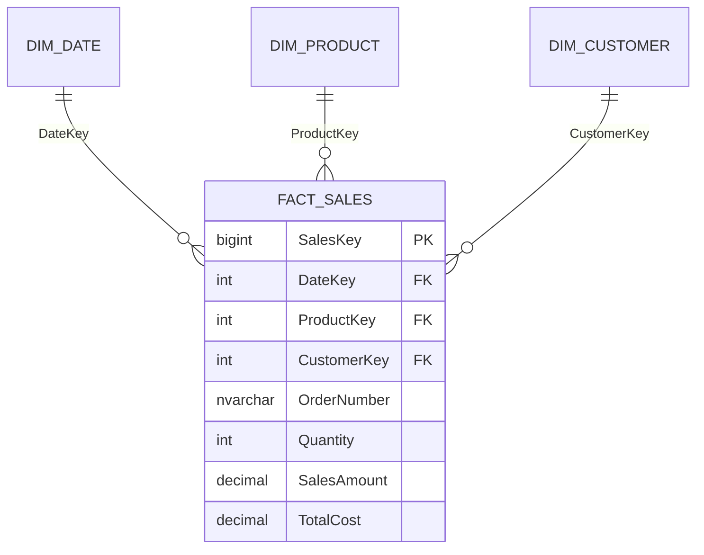

<!-- Generated by SpecStory, Markdown v2.1.0 -->

# 2026-10-01 07:15:42Z

<!-- VS Code Copilot IDE Session 7b5b065a-732b-424b-a208-2661a897bf82 (2026-10-01 07:15:42Z) -->

_**User (2026-10-01 07:15:42Z)**_

Pracujesz jako analityk hurtowni danych.

Napisz przykładowe złożone zapytanie SQL.


---

_**Agent (anthropic/Anthropic 2/claude-sonnet-5-5)**_

Poniżej przykładowe złożone zapytanie (dialekt T-SQL / SQL Server) dla hurtowni sprzedaży w schemacie gwiazdy. Zapytanie zwraca ranking produktów w kategoriach, sprzedaż narastającą (YTD) i dynamikę rok do roku.

```sql
WITH monthly_sales AS (
    -- Agregacja faktów do poziomu miesiąc / kategoria / produkt
    SELECT
        d.[Year]                         AS sales_year,
        d.[Month]                        AS sales_month,
        p.CategoryName,
        p.ProductKey,
        p.ProductName,
        SUM(f.SalesAmount)               AS revenue,
        SUM(f.Quantity)                  AS units,
        SUM(f.SalesAmount - f.TotalCost) AS margin
    FROM fact.Sales        AS f
    JOIN dim.[Date]        AS d ON d.DateKey     = f.DateKey
    JOIN dim.Product       AS p ON p.ProductKey  = f.ProductKey
    JOIN dim.Customer      AS c ON c.CustomerKey = f.CustomerKey
    WHERE d.[Year] BETWEEN 2023 AND 2025
      AND c.IsActive = 1
    GROUP BY d.[Year], d.[Month], p.CategoryName, p.ProductKey, p.ProductName
),
with_windows AS (
    SELECT
        ms.*,
        -- Sprzedaż narastająca od początku roku
        SUM(ms.revenue) OVER (
            PARTITION BY ms.ProductKey, ms.sales_year
            ORDER BY ms.sales_month
            ROWS BETWEEN UNBOUNDED PRECEDING AND CURRENT ROW
        ) AS revenue_ytd,
        -- Ten sam miesiąc rok wcześniej
        LAG(ms.revenue, 12) OVER (
            PARTITION BY ms.ProductKey
            ORDER BY ms.sales_year, ms.sales_month
        ) AS revenue_prev_year,
        -- Średnia ruchoma z 3 miesięcy
        AVG(ms.revenue) OVER (
            PARTITION BY ms.ProductKey
            ORDER BY ms.sales_year, ms.sales_month
            ROWS BETWEEN 2 PRECEDING AND CURRENT ROW
        ) AS revenue_ma3,
        -- Ranking w kategorii w danym miesiącu
        DENSE_RANK() OVER (
            PARTITION BY ms.CategoryName, ms.sales_year, ms.sales_month
            ORDER BY ms.revenue DESC
        ) AS rank_in_category,
        -- Udział produktu w sprzedaży kategorii
        ms.revenue * 1.0
            / NULLIF(SUM(ms.revenue) OVER (
                PARTITION BY ms.CategoryName, ms.sales_year, ms.sales_month), 0) AS category_share
    FROM monthly_sales AS ms
)
SELECT
    w.sales_year,
    w.sales_month,
    w.CategoryName,
    w.ProductName,
    w.revenue,
    w.units,
    CAST(100.0 * w.margin / NULLIF(w.revenue, 0) AS DECIMAL(5,2))        AS margin_pct,
    w.revenue_ytd,
    CAST(100.0 * (w.revenue - w.revenue_prev_year)
         / NULLIF(w.revenue_prev_year, 0) AS DECIMAL(7,2))               AS yoy_growth_pct,
    CAST(w.revenue_ma3 AS DECIMAL(18,2))                                 AS revenue_ma3,
    CAST(100.0 * w.category_share AS DECIMAL(5,2))                       AS category_share_pct,
    w.rank_in_category,
    CASE
        WHEN w.revenue_prev_year IS NULL            THEN 'Nowy'
        WHEN w.revenue > w.revenue_prev_year * 1.2  THEN 'Szybki wzrost'
        WHEN w.revenue < w.revenue_prev_year * 0.8  THEN 'Spadek'
        ELSE 'Stabilny'
    END AS trend_segment
FROM with_windows AS w
WHERE w.rank_in_category <= 5
  AND w.sales_year = 2025
  AND EXISTS (
        -- Tylko produkty sprzedawane w co najmniej 6 różnych miesiącach
        SELECT 1
        FROM monthly_sales AS x
        WHERE x.ProductKey = w.ProductKey
        GROUP BY x.ProductKey
        HAVING COUNT(*) >= 6
  )
ORDER BY w.sales_month, w.CategoryName, w.rank_in_category;
```

Użyte techniki:
- **CTE** rozbijają logikę na etapy: agregację i funkcje okna.
- **Funkcje okna**: `SUM() OVER` (YTD), `LAG` (YoY), `AVG() OVER` z ramką (średnia ruchoma), `DENSE_RANK` (ranking) i udział w partycji.
- **`NULLIF`** chroni przed dzieleniem przez zero.
- **`EXISTS`** z `HAVING` filtruje produkty z wystarczającą historią.
- **`CASE`** segmentuje trend.

Mogę dostosować zapytanie do innego dialektu (PostgreSQL, Oracle, BigQuery) albo do konkretnego schematu.

---

_**User (2026-10-01 07:16:36Z)**_

Schemat dla hurtowni danych

---

_**Agent (anthropic/Anthropic 2/claude-sonnet-5-5)**_

Poniżej schemat gwiazdy (T-SQL) zgodny z zapytaniem z poprzedniej odpowiedzi: tabela faktów `fact.Sales` i wymiary `dim.Date`, `dim.Product`, `dim.Customer`.

```sql
CREATE SCHEMA dim;
GO
CREATE SCHEMA fact;
GO

-- Wymiar daty
CREATE TABLE dim.[Date] (
    DateKey        INT         NOT NULL PRIMARY KEY,   -- YYYYMMDD
    FullDate       DATE        NOT NULL UNIQUE,
    [Year]         SMALLINT    NOT NULL,
    [Quarter]      TINYINT     NOT NULL,
    [Month]        TINYINT     NOT NULL,
    MonthName      NVARCHAR(20) NOT NULL,
    [Day]          TINYINT     NOT NULL,
    DayOfWeek      TINYINT     NOT NULL,
    IsWeekend      BIT         NOT NULL,
    IsHoliday      BIT         NOT NULL DEFAULT 0
);

-- Wymiar produktu
CREATE TABLE dim.Product (
    ProductKey     INT IDENTITY(1,1) PRIMARY KEY,      -- klucz zastępczy
    ProductID      NVARCHAR(30)  NOT NULL,             -- klucz biznesowy
    ProductName    NVARCHAR(200) NOT NULL,
    CategoryName   NVARCHAR(100) NOT NULL,
    SubcategoryName NVARCHAR(100) NULL,
    Brand          NVARCHAR(100) NULL,
    ListPrice      DECIMAL(18,2) NULL,
    -- SCD typu 2
    ValidFrom      DATE        NOT NULL,
    ValidTo        DATE        NULL,
    IsCurrent      BIT         NOT NULL DEFAULT 1
);

-- Wymiar klienta
CREATE TABLE dim.Customer (
    CustomerKey    INT IDENTITY(1,1) PRIMARY KEY,
    CustomerID     NVARCHAR(30)  NOT NULL,
    CustomerName   NVARCHAR(200) NOT NULL,
    Segment        NVARCHAR(50)  NULL,
    Country        NVARCHAR(100) NULL,
    City           NVARCHAR(100) NULL,
    IsActive       BIT         NOT NULL DEFAULT 1,
    -- SCD typu 2
    ValidFrom      DATE        NOT NULL,
    ValidTo        DATE        NULL,
    IsCurrent      BIT         NOT NULL DEFAULT 1
);

-- Tabela faktów (ziarno: pozycja zamówienia)
CREATE TABLE fact.Sales (
    SalesKey       BIGINT IDENTITY(1,1) PRIMARY KEY,
    DateKey        INT           NOT NULL REFERENCES dim.[Date](DateKey),
    ProductKey     INT           NOT NULL REFERENCES dim.Product(ProductKey),
    CustomerKey    INT           NOT NULL REFERENCES dim.Customer(CustomerKey),
    OrderNumber    NVARCHAR(30)  NOT NULL,             -- wymiar z

Poniżej schemat gwiazdy (T-SQL) zgodny z zapytaniem z poprzedniej odpowiedzi: tabela faktów `fact.Sales` i wymiary `dim.Date`, `dim.Product`, `dim.Customer`.

```sql
CREATE SCHEMA dim;
GO
CREATE SCHEMA fact;
GO

-- Wymiar daty
CREATE TABLE dim.[Date] (
    DateKey        INT         NOT NULL PRIMARY KEY,   -- YYYYMMDD
    FullDate       DATE        NOT NULL UNIQUE,
    [Year]         SMALLINT    NOT NULL,
    [Quarter]      TINYINT     NOT NULL,
    [Month]        TINYINT     NOT NULL,
    MonthName      NVARCHAR(20) NOT NULL,
    [Day]          TINYINT     NOT NULL,
    DayOfWeek      TINYINT     NOT NULL,
    IsWeekend      BIT         NOT NULL,
    IsHoliday      BIT         NOT NULL DEFAULT 0
);

-- Wymiar produktu
CREATE TABLE dim.Product (
    ProductKey     INT IDENTITY(1,1) PRIMARY KEY,      -- klucz zastępczy
    ProductID      NVARCHAR(30)  NOT NULL,             -- klucz biznesowy
    ProductName    NVARCHAR(200) NOT NULL,
    CategoryName   NVARCHAR(100) NOT NULL,
    SubcategoryName NVARCHAR(100) NULL,
    Brand          NVARCHAR(100) NULL,
    ListPrice      DECIMAL(18,2) NULL,
    -- SCD typu 2
    ValidFrom      DATE        NOT NULL,
    ValidTo        DATE        NULL,
    IsCurrent      BIT         NOT NULL DEFAULT 1
);

-- Wymiar klienta
CREATE TABLE dim.Customer (
    CustomerKey    INT IDENTITY(1,1) PRIMARY KEY,
    CustomerID     NVARCHAR(30)  NOT NULL,
    CustomerName   NVARCHAR(200) NOT NULL,
    Segment        NVARCHAR(50)  NULL,
    Country        NVARCHAR(100) NULL,
    City           NVARCHAR(100) NULL,
    IsActive       BIT         NOT NULL DEFAULT 1,
    -- SCD typu 2
    ValidFrom      DATE        NOT NULL,
    ValidTo        DATE        NULL,
    IsCurrent      BIT         NOT NULL DEFAULT 1
);

-- Tabela faktów (ziarno: pozycja zamówienia)
CREATE TABLE fact.Sales (
    SalesKey       BIGINT IDENTITY(1,1) PRIMARY KEY,
    DateKey        INT           NOT NULL REFERENCES dim.[Date](DateKey),
    ProductKey     INT           NOT NULL REFERENCES dim.Product(ProductKey),
    CustomerKey    INT           NOT NULL REFERENCES dim.Customer(CustomerKey),
    OrderNumber    NVARCHAR(30)  NOT NULL,             -- wymiar zdegenerowany
    OrderLineNo    INT           NOT NULL,
    Quantity       INT           NOT NULL,
    SalesAmount    DECIMAL(18,2) NOT NULL,
    TotalCost      DECIMAL(18,2) NOT NULL,
    CONSTRAINT UQ_Sales_Line UNIQUE (OrderNumber, OrderLineNo)
);

-- Indeksy wspierające typowe zapytania analityczne
CREATE INDEX IX_Sales_Date     ON fact.Sales (DateKey)     INCLUDE (ProductKey, CustomerKey, Quantity, SalesAmount, TotalCost);
CREATE INDEX IX_Sales_Product  ON fact.Sales (ProductKey);
CREATE INDEX IX_Sales_Customer ON fact.Sales (CustomerKey);
```



Założenia:
- Klucze zastępcze w wymiarach i klucz daty `YYYYMMDD`.
- Wymiary produktu i klienta mają SCD typu 2 (`ValidFrom`, `ValidTo`, `IsCurrent`).
- Ziarno faktów to pojedyncza pozycja zamówienia, a `OrderNumber` jest wymiarem zdegenerowanym.
- Dla dużych wolumenów można dodać columnstore (`CREATE CLUSTERED COLUMNSTORE INDEX`) zamiast indeksów rowstore.

Mogę dodać skrypt generujący `dim.Date` albo przykładowe dane testowe.

---

_**User (2026-10-01 07:17:18Z)**_

Pracujesz jako analityk hurtowni danych. Przygotuj nową wersję odpowiedzi na moje pierwsze pytanie.


---

_**Agent (anthropic/Anthropic 2/claude-sonnet-5-5)**_

Poniżej nowa wersja zapytania (T-SQL), dopasowana do schematu gwiazdy z poprzedniej odpowiedzi. Zmiany względem pierwszej wersji:

- Agregacja po kluczu biznesowym `ProductID`, a nie po `ProductKey`. Przy SCD2 jeden produkt ma wiele kluczy zastępczych, więc ranking i YoY byłyby zaniżone.
- YoY liczone self-joinem po `DATEADD(YEAR, -1, …)`. `LAG(…, 12)` daje błędne wyniki, gdy w danych brakuje miesięcy.
- Zamiast filtra `c.IsActive = 1` (bieżący stan klienta zniekształca historię) jest filtr po segmencie.
- Warunek minimalnej historii liczony tylko dla analizowanego roku.
- Parametry zebrane na górze.

```sql
DECLARE @year    INT          = 2025;
DECLARE @segment NVARCHAR(50) = N'B2B';
DECLARE @top_n   INT          = 5;
DECLARE @min_active_months INT = 6;

WITH monthly_sales AS (
    -- Ziarno: miesiąc x produkt (klucz biznesowy); bieżący rok i rok poprzedni dla YoY
    SELECT
        DATEFROMPARTS(d.[Year], d.[Month], 1) AS month_start,
        d.[Year]                              AS sales_year,
        d.[Month]                             AS sales_month,
        p.ProductID,
        MAX(p.ProductName)                    AS ProductName,
        MAX(p.CategoryName)                   AS CategoryName,
        SUM(f.SalesAmount)                    AS revenue,
        SUM(f.Quantity)                       AS units,
        SUM(f.SalesAmount - f.TotalCost)      AS margin
    FROM fact.Sales   AS f
    JOIN dim.[Date]   AS d ON d.DateKey     = f.DateKey
    JOIN dim.Product  AS p ON p.ProductKey  = f.ProductKey
    JOIN dim.Customer AS c ON c.CustomerKey = f.CustomerKey
    WHERE d.[Year] IN (@year - 1, @year)
      AND c.Segment = @segment
    GROUP BY d.[Year], d.[Month], p.ProductID
),
with_yoy AS (
    SELECT
        cur.*,
        prev.revenue AS revenue_prev_year
    FROM monthly_sales AS cur
    LEFT JOIN monthly_sales AS prev
           ON prev.ProductID  = cur.ProductID
          AND prev.month_start = DATEADD(YEAR, -1, cur.month_start)
),
with_windows AS (
    SELECT
        y.*,
        SUM(y.revenue) OVER (
            PARTITION BY y.ProductID, y.sales_year
            ORDER BY y.month_start
            ROWS BETWEEN UNBOUNDED PRECEDING AND CURRENT ROW
        ) AS revenue_ytd,
        AVG(y.revenue) OVER (
            PARTITION BY y.ProductID
            ORDER BY y.month_start
            ROWS BETWEEN 2 PRECEDING AND CURRENT ROW
        ) AS revenue_ma3,
        DENSE_RANK() OVER (
            PARTITION BY y.CategoryName, y.month_start
            ORDER BY y.revenue DESC
        ) AS rank_in_category,
        y.revenue * 1.0
            / NULLIF(SUM(y.revenue) OVER (PARTITION BY y.CategoryName, y.month_start), 0)
            AS category_share,
        COUNT(*) OVER (PARTITION BY y.ProductID, y.sales_year) AS active_months
    FROM with_yoy AS y
)
SELECT
    w.month_start,
    w.CategoryName,
    w.ProductID,
    w.ProductName,
    w.revenue,
    w.units,
    CAST(100.0 * w.margin / NULLIF(w.revenue, 0) AS DECIMAL(6,2))               AS margin_pct,
    w.revenue_ytd,
    CAST(w.revenue_ma3 AS DECIMAL(18,2))                                        AS revenue_ma3,
    CAST(100.0 * (w.revenue - w.revenue_prev_year)
         / NULLIF(w.revenue_prev_year, 0) AS DECIMAL(8,2))                      AS yoy_growth_pct,
    CAST(100.0 * w.category_share AS DECIMAL(5,2))                              AS category_share_pct,
    w.rank_in_category,
    CASE
        WHEN w.revenue_prev_year IS NULL           THEN N'Nowy'
        WHEN w.revenue > w.revenue_prev_year * 1.2 THEN N'Szybki wzrost'
        WHEN w.revenue < w.revenue_prev_year * 0.8 THEN N'Spadek'
        ELSE N'Stabilny'
    END AS trend_segment
FROM with_windows AS w
WHERE w.sales_year        = @year
  AND w.rank_in_category <= @top_n
  AND w.active_months    >= @min_active_months
ORDER BY w.month_start, w.CategoryName, w.rank_in_category;
```

Dodatkowe uwagi:
- `AVG … ROWS BETWEEN 2 PRECEDING` liczy po 3 ostatnich wierszach produktu, a nie po 3 miesiącach kalendarzowych. Przy lukach w sprzedaży potrzebny jest szkielet dat (`CROSS JOIN` produktów i miesięcy z `dim.Date`).
- Przy `DENSE_RANK` remisy dają więcej niż `@top_n` wierszy w kategorii. Gdy potrzebny jest dokładnie top N, zamień na `ROW_NUMBER`.
- Przy dużych wolumenach pomaga clustered columnstore na `fact.Sales` oraz indeks po `DateKey` z kolumnami `INCLUDE`.

Mogę przygotować wariant z szkieletem dat albo przepisać zapytanie na PostgreSQL.

---

_**User (2026-10-01 07:22:40Z)**_

Firma odzieżowa sprzedaje w sklepach stacjonarnych i online.
Dane obejmują sprzedaż, zamówienia, zwroty i stany magazynowe.
Przygotuj nową wersję odpowiedzi na moje pierwsze pytanie.


---

_**Agent (anthropic/Anthropic 2/claude-sonnet-5-5)**_

Poniżej nowa wersja zapytania (T-SQL) dla firmy odzieżowej ze sprzedażą stacjonarną i online. Łączy sprzedaż, zamówienia, zwroty i stany magazynowe na poziomie miesiąc × kanał × model (`ProductID`).

## Założenia modelu

| Tabela | Ziarno / uwagi |
|---|---|
| `fact.Sales` | Pozycja zamówienia: `DateKey`, `ProductKey`, `StoreKey`, `OrderNumber`, `OrderLineNo`, `Quantity`, `SalesAmount`, `TotalCost` |
| `fact.Returns` | Pozycja zwrotu: `DateKey`, `ProductKey`, `StoreKey`, `OrderNumber`, `ReturnQuantity`, `RefundAmount`, `ReturnReason` |
| `fact.InventorySnapshot` | Stan na dzień, SKU × lokalizacja: `DateKey`, `ProductKey`, `StoreKey`, `UnitsOnHand` |
| `dim.Store` | `StoreKey`, `StoreName`, `Channel` (`N'Stacjonarny'` lub `N'Online'`), `Region`. Magazyn e-commerce jest traktowany jak lokalizacja kanału Online. |
| `dim.Product` | SCD2, `ProductKey` (SKU i rozmiar), `ProductID` (model), `CategoryName`, `Season`, `Size`, `Color`, `IsCurrent` |
| `dim.[Date]` | Dodatkowa flaga `IsMonthEnd` |

```sql
DECLARE @year  INT = 2025;
DECLARE @top_n INT = 10;

WITH styles AS (
    -- Aktualne atrybuty modelu; SCD2 daje wiele ProductKey na jeden ProductID
    SELECT ProductID, MAX(ProductName) AS ProductName, MAX(CategoryName) AS CategoryName
    FROM dim.Product
    WHERE IsCurrent = 1
    GROUP BY ProductID
),
sales_m AS (
    SELECT DATEFROMPARTS(d.[Year], d.[Month], 1) AS month_start,
           s.Channel, p.ProductID,
           SUM(f.Quantity)                  AS units,
           SUM(f.SalesAmount)               AS revenue,
           SUM(f.SalesAmount - f.TotalCost) AS margin,
           COUNT(DISTINCT f.OrderNumber)    AS orders
    FROM fact.Sales  AS f
    JOIN dim.[Date]  AS d ON d.DateKey    = f.DateKey
    JOIN dim.Product AS p ON p.ProductKey = f.ProductKey
    JOIN dim.Store   AS s ON s.StoreKey   = f.StoreKey
    WHERE d.[Year] IN (@year - 1, @year)
    GROUP BY DATEFROMPARTS(d.[Year], d.[Month], 1), s.Channel, p.ProductID
),
returns_m AS (
    -- Zwroty wg daty zwrotu, nie daty sprzedaży
    SELECT DATEFROMPARTS(d.[Year], d.[Month], 1) AS month_start,
           s.Channel, p.ProductID,
           SUM(r.ReturnQuantity) AS returned_units,
           SUM(r.RefundAmount)   AS refund_amount
    FROM fact.Returns AS r
    JOIN dim.[Date]   AS d ON d.DateKey    = r.DateKey
    JOIN dim.Product  AS p ON p.ProductKey = r.ProductKey
    JOIN dim.Store    AS s ON s.StoreKey   = r.StoreKey
    WHERE d.[Year] IN (@year - 1, @year)
    GROUP BY DATEFROMPARTS(d.[Year], d.[Month], 1), s.Channel, p.ProductID
),
inventory_m AS (
    -- Stan póładdytywny: tylko migawka z końca miesiąca, bez sumowania w czasie
    SELECT DATEFROMPARTS(d.[Year], d.[Month], 1) AS month_start,
           s.Channel, p.ProductID,
           SUM(i.UnitsOnHand) AS units_on_hand
    FROM fact.InventorySnapshot AS i
    JOIN dim.[Date]  AS d ON d.DateKey    = i.DateKey
    JOIN dim.Product AS p ON p.ProductKey = i.ProductKey
    JOIN dim.Store   AS s ON s.StoreKey   = i.StoreKey
    WHERE d.IsMonthEnd = 1
      AND d.[Year] IN (@year - 1, @year)
    GROUP BY DATEFROMPARTS(d.[Year], d.[Month], 1), s.Channel, p.ProductID
),
grain AS (
    -- Suma kluczy z trzech faktów, by nie zgubić modeli bez sprzedaży (martwy zapas)
    SELECT month_start, Channel, ProductID FROM sales_m
    UNION
    SELECT month_start, Channel, ProductID FROM returns_m
    UNION
    SELECT month_start, Channel, ProductID FROM inventory_m
),
base AS (
    SELECT g.month_start, g.Channel, g.ProductID, st.ProductName, st.CategoryName,
           ISNULL(s.units, 0)          AS units,
           ISNULL(s.orders, 0)         AS orders,
           ISNULL(s.revenue, 0)        AS revenue,
           ISNULL(s.margin, 0)         AS margin,
           ISNULL(r.returned_units, 0) AS returned_units,
           ISNULL(r.refund_amount, 0)  AS refund_amount,
           ISNULL(i.units_on_hand, 0)  AS units_on_hand
    FROM grain AS g
    JOIN styles AS st ON st.ProductID = g.ProductID
    LEFT JOIN sales_m     AS s ON s.month_start = g.month_start AND s.Channel = g.Channel AND s.ProductID = g.ProductID
    LEFT JOIN returns_m   AS r ON r.month_start = g.month_start AND r.Channel = g.Channel AND r.ProductID = g.ProductID
    LEFT JOIN inventory_m AS i ON i.month_start = g.month_start AND i.Channel = g.Channel AND i.ProductID = g.ProductID
),
kpi AS (
    SELECT b.*,
           b.revenue - b.refund_amount AS net_revenue,
           b.units / (DAY(EOMONTH(b.month_start)) / 7.0) AS units_per_week
    FROM base AS b
),
with_yoy AS (
    SELECT cur.*, prev.net_revenue AS net_revenue_prev_year
    FROM kpi AS cur
    LEFT JOIN kpi AS prev
           ON prev.ProductID   = cur.ProductID
          AND prev.Channel     = cur.Channel
          AND prev.month_start = DATEADD(YEAR, -1, cur.month_start)
),
with_windows AS (
    SELECT y.*,
           SUM(y.net_revenue) OVER (
               PARTITION BY y.ProductID, y.Channel, YEAR(y.month_start)
               ORDER BY y.month_start
               ROWS BETWEEN UNBOUNDED PRECEDING AND CURRENT ROW) AS net_revenue_ytd,
           DENSE_RANK() OVER (
               PARTITION BY y.Channel, y.CategoryName, y.month_start
               ORDER BY y.net_revenue DESC) AS rank_in_category,
           y.net_revenue * 1.0
               / NULLIF(SUM(y.net_revenue) OVER (
                     PARTITION BY y.Channel, y.CategoryName, y.month_start), 0) AS category_share
    FROM with_yoy AS y
)
SELECT
    w.month_start,
    w.Channel,
    w.CategoryName,
    w.ProductID,
    w.ProductName,
    w.units,
    w.orders,
    w.net_revenue,
    w.net_revenue_ytd,
    CAST(100.0 * w.margin / NULLIF(w.revenue, 0) AS DECIMAL(6,2))                AS margin_pct,
    CAST(100.0 * w.returned_units / NULLIF(w.units, 0) AS DECIMAL(6,2))          AS return_rate_pct,
    CAST(100.0 * w.units / NULLIF(w.units + w.units_on_hand, 0) AS DECIMAL(6,2)) AS sell_through_pct,
    w.units_on_hand,
    CAST(w.units_on_hand / NULLIF(w.units_per_week, 0) AS DECIMAL(8,1))          AS weeks_of_cover,
    CAST(100.0 * (w.net_revenue - w.net_revenue_prev_year)
         / NULLIF(w.net_revenue_prev_year, 0) AS DECIMAL(8,2))                   AS yoy_growth_pct,
    CAST(100.0 * w.category_share AS DECIMAL(5,2))                               AS category_share_pct,
    w.rank_in_category,
    CASE
        WHEN w.units = 0 AND w.units_on_hand > 0                          THEN N'Martwy zapas'
        WHEN w.units_on_hand / NULLIF(w.units_per_week, 0) < 2            THEN N'Ryzyko braku towaru'
        WHEN 100.0 * w.returned_units / NULLIF(w.units, 0) > 30           THEN N'Wysoki zwrot'
        WHEN w.units_on_hand / NULLIF(w.units_per_week, 0) > 26           THEN N'Nadmiar zapasu'
        ELSE N'OK'
    END AS inventory_flag
FROM with_windows AS w
WHERE YEAR(w.month_start) = @year
  AND (w.rank_in_category <= @top_n
       OR (w.units = 0 AND w.units_on_hand > 0))
ORDER BY w.month_start, w.Channel, w.CategoryName, w.rank_in_category;
```

## Co się zmieniło względem poprzednich wersji

- **Kanały:** każdy wskaźnik jest liczony osobno dla sklepów stacjonarnych i online, bo zwroty i rotacja różnią się między nimi.
- **Brak fan-outu:** sprzedaż, zwroty i stany są agregowane osobno do wspólnego ziarna, dopiero potem łączone. Bezpośredni join faktów zwielokrotniłby kwoty.
- **Sprzedaż netto:** `net_revenue` to sprzedaż pomniejszona o zwroty.
- **Wskaźniki specyficzne dla odzieży:**
  - `return_rate_pct`
  - `sell_through_pct`
  - `weeks_of_cover`
  - flagi `inventory_flag`: martwy zapas, ryzyko braku towaru, nadmiar zapasu, wysoki zwrot
- **Stan magazynowy:** to wielkość póładdytywna, więc używam wyłącznie migawki z końca miesiąca.
- **Martwy zapas:** model bez sprzedaży, ale ze stanem, trafia do wyniku dzięki zbiorowi kluczy `grain`.

## Uwagi

- Zwroty są przypisane do miesiąca zwrotu. Żeby liczyć zwrotność względem miesiąca sprzedaży (kohorta), trzeba łączyć `fact.Returns` z `fact.Sales` po `OrderNumber`.
- Progi flag (2 i 26 tygodni, 30% zwrotów) są przykładowe i zależą od sezonu oraz kategorii.
- Analiza rozmiarów (np. rozmiar M zwracany częściej niż L) wymaga zmiany ziarna z `ProductID` na `ProductID` + `Size`.

Mogę przygotować DDL dla `fact.Returns`, `fact.InventorySnapshot` i `dim.Store`, albo wariant w PostgreSQL.

---

_**User (2026-10-01 07:26:45Z)**_

Odpowiedz w układzie: cel; założenia i braki; proponowany SQL
z komentarzami inline; sposób sprawdzenia.
Nie przedstawiaj nieznanych tabel i kolumn jako potwierdzonych.
Przygotuj nową wersję odpowiedzi na moje pierwsze pytanie.


---

_**Agent (anthropic/Anthropic 2/claude-sonnet-5-5)**_

<tool-use data-tool-type="generic" data-tool-name="list_dir"><details>
<summary>Tool use: **list_dir**</summary>

Read `infoshare-silkycoders-sql-ai-3`

**Input:**

- path: `c:\Users\teamsharq\Documents\infoshare-silkycoders-sql-ai-3`

**Result:**

```
.git/
docs/
README.md
zgloszenia/
```
</details></tool-use>

_**Agent (anthropic/Anthropic 2/claude-sonnet-5-5)**_

<tool-use data-tool-type="read" data-tool-name="read_file"><details>
<summary>Tool use: **read_file**</summary>

Read `eksperymenty-ask.md`

**Input:**

- endLine: `200`
- filePath: `c:\Users\teamsharq\Documents\infoshare-silkycoders-sql-ai-3\zgloszenia\E00\eksperymenty-ask.md`
- startLine: `1`

**Result:**

````
# E00 — Szkic zapytania SQL

**Od:** Ola, liderka zespołu analiz  
**Do:** Zespół analiz  
**Temat:** Zapytanie do rozmowy z zespołem hurtowni

```text
Cześć,

potrzebuję roboczego przykładu zapytania SQL dotyczącego sprzedaży odzieży
w sklepach i online. Nie mamy jeszcze opisu tabel ani uzgodnionej definicji
sprzedaży. Przygotuj szkic i pytania, które musimy wyjaśnić przed użyciem go
w raporcie.

Ola
```

## Zadania

W kroku 1 rozpocznij rozmowę w ASK. Kroki 2–5 wykonaj jako **kolejne wiadomości w tym samym czacie**. Wklejaj tylko blok z bieżącego kroku, bez powtarzania wcześniejszych poleceń. Po każdym kroku zapisz jedną obserwację. Nową rozmowę otworzysz dopiero w kroku 6, aby porównać ją z dotychczasową.

1. **Bez kontekstu.** Porównaj odpowiedź z odpowiedzią innej osoby.

   ```text
   Napisz przykładowe złożone zapytanie SQL.
   ```

2. **Rola.** W tym samym czacie dopisz:

   ```text
   Pracujesz jako analityk hurtowni danych. Przygotuj nową wersję odpowiedzi na moje pierwsze pytanie.
   ```

3. **Domena.** W tym samym czacie dopisz opis firmy i rodzajów danych; nadal nie podawaj nazw tabel.

   ```text
   Firma odzieżowa sprzedaje w sklepach stacjonarnych i online.
   Dane obejmują sprzedaż, zamówienia, zwroty i stany magazynowe.
   Przygotuj nową wersję odpowiedzi na moje pierwsze pytanie.
   ```

4. **Sposób odpowiedzi.** W tym samym czacie dopisz układ odpowiedzi i regułę dotyczącą nieznanych nazw.

   ```text
   Odpowiedz w układzie: cel; założenia i braki; proponowany SQL
   z komentarzami inline; sposób sprawdzenia.
   Nie przedstawiaj nieznanych tabel i kolumn jako potwierdzonych.
   Przygotuj nową wersję odpowiedzi na moje pierwsze pytanie.
   ```

5. **Przykład.** W tym samym czacie dopisz krótki fragment odpowiedzi z kroku 4, pokazujący jej cztery części.

   ```text
   Przykład układu z poprzedniej próby (niezweryfikowany):
   [wklej krótki fragment odpowiedzi z kroku 4]
   Zachowaj układ, ale
… (output truncated)
````
</details></tool-use>

_**Agent (anthropic/Anthropic 2/claude-sonnet-5-5)**_

## 1. Cel

Szkic zapytania do rozmowy z zespołem hurtowni: miesięczna sprzedaż odzieży w kanałach stacjonarnym i online, ze zwrotami i stanem magazynowym. Zapytanie jest **roboczym przykładem**. Nie nadaje się do raportu, dopóki nie zostanie uzgodniony opis tabel i definicja sprzedaży.

## 2. Założenia i braki

Nie znamy schematu bazy. Wszystkie nazwy poniżej są **hipotetyczne** i do zastąpienia po otrzymaniu opisu tabel.

**Hipotetyczne obiekty (niepotwierdzone):**

| Obiekt | Użyte kolumny | Status |
|---|---|---|
| `fact.Sales` | `DateKey`, `ProductKey`, `StoreKey`, `OrderNumber`, `Quantity`, `SalesAmount` | niepotwierdzone |
| `fact.Returns` | `DateKey`, `ProductKey`, `StoreKey`, `ReturnQuantity`, `RefundAmount` | niepotwierdzone |
| `fact.InventorySnapshot` | `DateKey`, `ProductKey`, `StoreKey`, `UnitsOnHand` | niepotwierdzone |
| `dim.Store` | `StoreKey`, `Channel` | niepotwierdzone, nie wiadomo, jak oznaczony jest kanał |
| `dim.Product` | `ProductKey`, `ProductID`, `CategoryName` | niepotwierdzone |
| `dim.[Date]` | `DateKey`, `Year`, `Month`, `IsMonthEnd` | niepotwierdzone |

**Założenia techniczne (do weryfikacji):**
- Dialekt to T-SQL (SQL Server). Nie wiadomo, jaki silnik działa w rzeczywistości.
- Sprzedaż, zwroty i stany to osobne tabele faktów o różnym ziarnie.
- Stan magazynowy jest zapisywany jako dzienna migawka. Do raportu bierzemy ostatni dzień miesiąca.
- Sprzedaż online jest rozpoznawalna po atrybucie sklepu lub magazynu.

**Braki, które trzeba wyjaśnić przed użyciem w raporcie:**
1. Definicja **sprzedaży**: brutto czy netto, z VAT czy bez, czy po rabatach, czy uwzględnia anulowane i niewysłane zamówienia.
2. Data sprzedaży: data zamówienia, wysyłki czy płatności. W sklepie stacjonarnym te daty się pokrywają, online nie.
3. Zwroty: przypisanie do miesiąca zwrotu czy do miesiąca sprzedaży (kohorta). Czy zwrot online i w sklepie jest zapisywany tak samo. Czy istnieje zwrot w innym kanale niż zakup.
4. Stany: czy migawka jest dzienna czy tygodniowa, czy zawiera magazyn centralny, czy zapasy w drodze i rezerwacje.
5. Produkty: poziom analizy (model, SKU, rozmiar i kolor), czy atrybuty zmieniają się w czasie (SCD).
6. Kanał: czy ma osobny wymiar, czy jest wyprowadzany z typu sklepu. Jak traktować zamówienia typu click & collect.
7. Waluta i strefa czasowa, jeśli firma działa w wielu krajach.
8. Zakres dat i oczekiwany poziom szczegółowości raportu.

## 3. Proponowany SQL

```sql
-- SZKIC ROBOCZY: wszystkie nazwy obiektów są hipotetyczne i wymagają potwierdzenia.
DECLARE @year INT = 2025;  -- zakres do uzgodnienia

WITH sales_m AS (
    -- Sprzedaż: definicja kwoty (brutto/netto, rabaty) niepotwierdzona
    SELECT d.[Year], d.[Month], s.Channel, p.ProductID,
           SUM(f.Quantity)               AS units,
           SUM(f.SalesAmount)            AS revenue,
           COUNT(DISTINCT f.OrderNumber) AS orders
    FROM fact.Sales  AS f
    JOIN dim.[Date]  AS d ON d.DateKey    = f.DateKey
    JOIN dim.Product AS p ON p.ProductKey = f.ProductKey
    JOIN dim.Store   AS s ON s.StoreKey   = f.StoreKey
    WHERE d.[Year] = @year
    GROUP BY d.[Year], d.[Month], s.Channel, p.ProductID
),
returns_m AS (
    -- Zwroty wg daty zwrotu; wariant kohortowy wymaga decyzji biznesowej
    SELECT d.[Year], d.[Month], s.Channel, p.ProductID,
           SUM(r.ReturnQuantity) AS returned_units,
           SUM(r.RefundAmount)   AS refund_amount
    FROM fact.Returns AS r
    JOIN dim.[Date]   AS d ON d.DateKey    = r.DateKey
    JOIN dim.Product  AS p ON p.ProductKey = r.ProductKey
    JOIN dim.Store    AS s ON s.StoreKey   = r.StoreKey
    WHERE d.[Year] = @year
    GROUP BY d.[Year], d.[Month], s.Channel, p.ProductID
),
inventory_m AS (
    -- Stan nie jest addytywny w czasie: tylko migawka z końca miesiąca
    -- (zakładamy, że istnieje flaga IsMonthEnd; do potwierdzenia)
    SELECT d.[Year], d.[Month], s.Channel, p.ProductID,
           SUM(i.UnitsOnHand) AS units_on_hand
    FROM fact.InventorySnapshot AS i
    JOIN dim.[Date]  AS d ON d.DateKey    = i.DateKey
    JOIN dim.Product AS p ON p.ProductKey = i.ProductKey
    JOIN dim.Store   AS s ON s.StoreKey   = i.StoreKey
    WHERE d.[Year] = @year
      AND d.IsMonthEnd = 1
    GROUP BY d.[Year], d.[Month], s.Channel, p.ProductID
),
grain AS (
    -- Suma kluczy z trzech źródeł, by nie zgubić modeli bez sprzedaży
    SELECT [Year], [Month], Channel, ProductID FROM sales_m
    UNION
    SELECT [Year], [Month], Channel, ProductID FROM returns_m
    UNION
    SELECT [Year], [Month], Channel, ProductID FROM inventory_m
)
SELECT
    g.[Year], g.[Month], g.Channel, g.ProductID,
    ISNULL(s.units, 0)          AS units,
    ISNULL(s.orders, 0)         AS orders,
    ISNULL(s.revenue, 0)        AS revenue,
    ISNULL(r.returned_units, 0) AS returned_units,
    ISNULL(r.refund_amount, 0)  AS refund_amount,
    ISNULL(i.units_on_hand, 0)  AS units_on_hand,
    -- Udział zwrotów w sztukach sprzedanych w tym samym miesiącu (nie kohorta)
    CAST(100.0 * ISNULL(r.returned_units, 0) / NULLIF(s.units, 0) AS DECIMAL(6,2)) AS return_rate_pct
FROM grain AS g
LEFT JOIN sales_m     AS s ON s.[Year] = g.[Year] AND s.[Month] = g.[Month] AND s.Channel = g.Channel AND s.ProductID = g.ProductID
LEFT JOIN returns_m   AS r ON r.[Year] = g.[Year] AND r.[Month] = g.[Month] AND r.Channel = g.Channel AND r.ProductID = g.ProductID
LEFT JOIN inventory_m AS i ON i.[Year] = g.[Year] AND i.[Month] = g.[Month] AND i.Channel = g.Channel AND i.ProductID = g.ProductID
ORDER BY g.[Year], g.[Month], g.Channel, g.ProductID;
```

Celowo pominięto wskaźniki zależne od niepotwierdzonych definicji: marżę (wymaga kosztu), sell-through, tygodnie pokrycia i progi flag. Można je dodać po uzgodnieniu definicji.

## 4. Sposób sprawdzenia

1. **Schemat:** porównać każdą nazwę z tabeli w sekcji 2 z `INFORMATION_SCHEMA.COLUMNS` lub opisem od zespołu hurtowni. Zapytanie nie uruchomi się, jeśli choć jedna nazwa jest błędna, i to jest pierwszy test.
2. **Wartości kanału:** sprawdzić `SELECT DISTINCT Channel FROM dim.Store`. Czy występują wartości odpowiadające sklepom stacjonarnym i online, i czy nie ma nieoczekiwanych (NULL, magazyn centralny).
3. **Uzgodnienie sumy:** porównać `SUM(revenue)` za rok z oficjalnym raportem finansowym lub księgowym. Różnica wskazuje na inną definicję sprzedaży (VAT, rabaty, anulowania).
4. **Brak zwielokrotnień:** `COUNT(*)` i suma `SalesAmount` z `fact.Sales` przed i po łączeniu z wymiarami powinny być równe. Różnica oznacza zduplikowane klucze w wymiarze (np. SCD2).
5. **Unikalność ziarna:** wynik nie powinien mieć duplikatów po `Year, Month, Channel, ProductID`. Sprawdza to `GROUP BY … HAVING COUNT(*) > 1`.
6. **Zwroty:** porównać `SUM(refund_amount)` z danymi działu obsługi klienta lub księgowości. Sprawdzić, czy zwroty bez dopasowanej sprzedaży (np. z poprzedniego roku) nie dają `return_rate_pct` powyżej 100.
7. **Stany:** wybrać 2–3 modele i porównać `units_on_hand` na koniec miesiąca z danymi systemu magazynowego.
8. **Próbka ręczna:** dla jednego sklepu i jednego miesiąca przeliczyć wynik z danych źródłowych i porównać z zapytaniem.

## Pytania do Oli przed użyciem w raporcie

- Jaka jest definicja sprzedaży (brutto/netto, VAT, rabaty, anulowania)?
- Czy zwroty mają być liczone wg miesiąca zwrotu czy sprzedaży?
- Jak rozpoznajemy kanał online i czy click & collect jest osobnym przypadkiem?
- Czy możemy dostać opis tabel (DDL lub słownik danych) i informację o silniku bazy?

---

_**User (2026-10-01 07:35:51Z)**_

Odpowiedz w układzie: cel; założenia i braki; proponowany SQL
z komentarzami inline; sposób sprawdzenia.
Nie przedstawiaj nieznanych tabel i kolumn jako potwierdzonych.
Przygotuj nową wersję odpowiedzi na moje pierwsze pytanie.


---

_**Agent (anthropic/Anthropic 2/claude-sonnet-5-5)**_

## Cel

Miesięczny raport dla firmy odzieżowej (sklepy stacjonarne i online) na poziomie miesiąc × kanał × model produktu. Łączy sprzedaż, zamówienia, zwroty i stany magazynowe. Wskazuje top N modeli w kategorii oraz modele z martwym zapasem lub ryzykiem braku towaru.

## Założenia i braki

Nie znam schematu. Wszystkie nazwy tabel i kolumn poniżej są **hipotezą do zweryfikowania**, a nie potwierdzonym faktem.

| Element | Status | Co trzeba potwierdzić |
|---|---|---|
| Dialekt T-SQL (SQL Server) | Założony | Silnik bazy. `DATEFROMPARTS`, `EOMONTH` i `ISNULL` nie działają wszędzie. |
| `fact.Sales` (`DateKey`, `ProductKey`, `StoreKey`, `OrderNumber`, `Quantity`, `SalesAmount`, `TotalCost`) | Niepotwierdzone | Nazwy, ziarno (pozycja zamówienia?), czy `SalesAmount` jest netto czy brutto. |
| `fact.Returns` (`DateKey`, `ProductKey`, `StoreKey`, `ReturnQuantity`, `RefundAmount`) | Niepotwierdzone | Czy zwroty są osobną tabelą. Czy mają `StoreKey`, czy tylko `OrderNumber`. |
| `fact.InventorySnapshot` (`DateKey`, `ProductKey`, `StoreKey`, `UnitsOnHand`) | Niepotwierdzone | Częstotliwość migawek (dzienna, tygodniowa?). Czy magazyn online jest w `dim.Store`. |
| `dim.Store` (`StoreKey`, `Channel`) | Niepotwierdzone | Skąd pochodzi kanał. Wartości `N'Stacjonarny'` i `N'Online'` są przykładowe. |
| `dim.Product` (`ProductKey`, `ProductID`, `ProductName`, `CategoryName`, `IsCurrent`) | Niepotwierdzone | Czy istnieje SCD2. Czy `ProductID` to model, a `ProductKey` to SKU. |
| `dim.[Date]` (`DateKey`, `[Year]`, `[Month]`) | Niepotwierdzone | Nazwy kolumn i format klucza. |
| Zwroty przypisane do daty zwrotu | Decyzja biznesowa | Alternatywa to kohorta według daty sprzedaży. |
| Progi flag (2 i 26 tygodni, 30% zwrotów) | Przykładowe | Wartości od biznesu, zależne od sezonu i kategorii. |

Braki, bez których wynik może być błędny:
- Brak informacji o jednostce i walucie kwot (wiele walut dla online?).
- Brak definicji „zamówienia" (czy anulowane są wykluczone?).
- Nie wiem, czy stany obejmują towar w tranzycie lub zarezerwowany.

## Proponowany SQL

```sql
-- Parametry raportu; wartości do uzgodnienia z biznesem
DECLARE @year  INT = 2025;
DECLARE @top_n INT = 10;

WITH sales_m AS (
    -- Sprzedaż agregowana osobno od zwrotów i stanów, żeby uniknąć mnożenia wierszy
    SELECT DATEFROMPARTS(d.[Year], d.[Month], 1) AS month_start,
           s.Channel,
           p.ProductID,
           SUM(f.Quantity)                  AS units,
           SUM(f.SalesAmount)               AS revenue,
           SUM(f.SalesAmount - f.TotalCost) AS margin,
           COUNT(DISTINCT f.OrderNumber)    AS orders
    FROM fact.Sales  AS f
    JOIN dim.[Date]  AS d ON d.DateKey    = f.DateKey
    JOIN dim.Product AS p ON p.ProductKey = f.ProductKey
    JOIN dim.Store   AS s ON s.StoreKey   = f.StoreKey
    WHERE d.[Year] IN (@year - 1, @year)   -- rok wcześniejszy potrzebny tylko do YoY
    GROUP BY DATEFROMPARTS(d.[Year], d.[Month], 1), s.Channel, p.ProductID
),
returns_m AS (
    -- ZAŁOŻENIE: zwrot należy do miesiąca zwrotu, nie sprzedaży
    SELECT DATEFROMPARTS(d.[Year], d.[Month], 1) AS month_start,
           s.Channel,
           p.ProductID,
           SUM(r.ReturnQuantity) AS returned_units,
           SUM(r.RefundAmount)   AS refund_amount
    FROM fact.Returns AS r
    JOIN dim.[Date]   AS d ON d.DateKey    = r.DateKey
    JOIN dim.Product  AS p ON p.ProductKey = r.ProductKey
    JOIN dim.Store    AS s ON s.StoreKey   = r.StoreKey
    WHERE d.[Year] IN (@year - 1, @year)
    GROUP BY DATEFROMPARTS(d.[Year], d.[Month], 1), s.Channel, p.ProductID
),
last_snapshot AS (
    -- Stan jest póładdytywny: bierzemy ostatnią migawkę miesiąca, nie sumę po dniach
    SELECT d.[Year], d.[Month], MAX(i.DateKey) AS snapshot_key
    FROM fact.InventorySnapshot AS i
    JOIN dim.[Date] AS d ON d.DateKey = i.DateKey
    WHERE d.[Year] IN (@year - 1, @year)
    GROUP BY d.[Year], d.[Month]
),
inventory_m AS (
    SELECT DATEFROMPARTS(ls.[Year], ls.[Month], 1) AS month_start,
           s.Channel,
           p.ProductID,
           SUM(i.UnitsOnHand) AS units_on_hand
    FROM fact.InventorySnapshot AS i
    JOIN last_snapshot AS ls ON ls.snapshot_key = i.DateKey
    JOIN dim.Product   AS p  ON p.ProductKey    = i.ProductKey
    JOIN dim.Store     AS s  ON s.StoreKey      = i.StoreKey
    GROUP BY DATEFROMPARTS(ls.[Year], ls.[Month], 1), s.Channel, p.ProductID
),
grain AS (
    -- UNION kluczy ze wszystkich faktów, żeby model bez sprzedaży, ale ze stanem, nie zniknął
    SELECT month_start, Channel, ProductID FROM sales_m
    UNION
    SELECT month_start, Channel, ProductID FROM returns_m
    UNION
    SELECT month_start, Channel, ProductID FROM inventory_m
),
products AS (
    -- ZAŁOŻENIE: IsCurrent = 1 wskazuje aktualny wiersz SCD2
    SELECT ProductID, MAX(ProductName) AS ProductName, MAX(CategoryName) AS CategoryName
    FROM dim.Product
    WHERE IsCurrent = 1
    GROUP BY ProductID
),
base AS (
    SELECT g.month_start, g.Channel, g.ProductID, pr.ProductName, pr.CategoryName,
           ISNULL(s.units, 0)          AS units,
           ISNULL(s.orders, 0)         AS orders,
           ISNULL(s.revenue, 0)        AS revenue,
           ISNULL(s.margin, 0)         AS margin,
           ISNULL(r.returned_units, 0) AS returned_units,
           ISNULL(r.refund_amount, 0)  AS refund_amount,
           ISNULL(i.units_on_hand, 0)  AS units_on_hand,
           ISNULL(s.revenue, 0) - ISNULL(r.refund_amount, 0)      AS net_revenue,
           ISNULL(s.units, 0) / (DAY(EOMONTH(g.month_start)) / 7.0) AS units_per_week
    FROM grain AS g
    JOIN products AS pr ON pr.ProductID = g.ProductID   -- INNER: model spoza słownika wypadnie, patrz test 4
    LEFT JOIN sales_m     AS s ON s.month_start = g.month_start AND s.Channel = g.Channel AND s.ProductID = g.ProductID
    LEFT JOIN returns_m   AS r ON r.month_start = g.month_start AND r.Channel = g.Channel AND r.ProductID = g.ProductID
    LEFT JOIN inventory_m AS i ON i.month_start = g.month_start AND i.Channel = g.Channel AND i.ProductID = g.ProductID
),
scored AS (
    SELECT b.*,
           prev.net_revenue AS net_revenue_prev_year,
           DENSE_RANK() OVER (PARTITION BY b.Channel, b.CategoryName, b.month_start
                              ORDER BY b.net_revenue DESC) AS rank_in_category
    FROM base AS b
    LEFT JOIN base AS prev   -- YoY po dacie, nie przez LAG(12), który psuje się przy lukach
           ON prev.ProductID   = b.ProductID
          AND prev.Channel     = b.Channel
          AND prev.month_start = DATEADD(YEAR, -1, b.month_start)
)
SELECT
    sc.month_start,
    sc.Channel,
    sc.CategoryName,
    sc.ProductID,
    sc.ProductName,
    sc.units,
    sc.orders,
    sc.net_revenue,
    CAST(100.0 * sc.margin / NULLIF(sc.revenue, 0) AS DECIMAL(6,2))                AS margin_pct,
    CAST(100.0 * sc.returned_units / NULLIF(sc.units, 0) AS DECIMAL(6,2))          AS return_rate_pct,
    CAST(100.0 * sc.units / NULLIF(sc.units + sc.units_on_hand, 0) AS DECIMAL(6,2)) AS sell_through_pct,
    sc.units_on_hand,
    CAST(sc.units_on_hand / NULLIF(sc.units_per_week, 0) AS DECIMAL(8,1))          AS weeks_of_cover,
    CAST(100.0 * (sc.net_revenue - sc.net_revenue_prev_year)
         / NULLIF(sc.net_revenue_prev_year, 0) AS DECIMAL(8,2))                    AS yoy_growth_pct,
    sc.rank_in_category,
    CASE
        WHEN sc.units = 0 AND sc.units_on_hand > 0                        THEN N'Martwy zapas'
        WHEN sc.units_on_hand / NULLIF(sc.units_per_week, 0) < 2          THEN N'Ryzyko braku towaru'  -- próg przykładowy
        WHEN 100.0 * sc.returned_units / NULLIF(sc.units, 0) > 30         THEN N'Wysoki zwrot'         -- próg przykładowy
        WHEN sc.units_on_hand / NULLIF(sc.units_per_week, 0) > 26         THEN N'Nadmiar zapasu'       -- próg przykładowy
        ELSE N'OK'
    END AS inventory_flag
FROM scored AS sc
WHERE YEAR(sc.month_start) = @year
  AND (sc.rank_in_category <= @top_n
       OR (sc.units = 0 AND sc.units_on_hand > 0))   -- martwy zapas zawsze w wyniku
ORDER BY sc.month_start, sc.Channel, sc.CategoryName, sc.rank_in_category;
```

## Sposób sprawdzenia

1. **Schemat.** Zanim uruchomisz zapytanie, sprawdź nazwy w `INFORMATION_SCHEMA.COLUMNS` dla każdej użytej tabeli. Błąd „Invalid column name" wskazuje chybione założenie.
2. **Uzgodnienie sum.** Dla jednego miesiąca porównaj `SUM(revenue)` z `sales_m` z `SUM(SalesAmount)` z `fact.Sales`. Zrób to samo dla zwrotów (`RefundAmount`). Różnica oznacza utratę wierszy w joinach.
3. **Ziarno.** Zapytanie `SELECT month_start, Channel, ProductID, COUNT(*) FROM base GROUP BY ... HAVING COUNT(*) > 1` powinno zwrócić 0 wierszy. Wynik inny niż 0 oznacza zdublowane klucze (fan-out).
4. **Osierocone klucze.** Policz klucze produktów i sklepów z faktów, których nie ma w wymiarach (`LEFT JOIN ... WHERE dim.Key IS NULL`). Inner join do `products` je pominie.
5. **Stany.** Dla jednego modelu porównaj `units_on_hand` z ręcznym odczytem ostatniej migawki miesiąca. Wartość nie powinna rosnąć wraz z liczbą dni migawek.
6. **Zakresy wskaźników.** `return_rate_pct` powyżej 100 oznacza zwroty z poprzednich miesięcy, więc rozważ kohortę. `sell_through_pct` mieści się w 0–100.
7. **Kanały.** Sprawdź `SELECT DISTINCT Channel FROM dim.Store`. Zapytanie nie filtruje po konkretnych wartościach, ale nieoczekiwane kanały (np. `NULL`) zaburzą rankingi.
8. **Test punktowy.** Wybierz jeden model, kanał i miesiąc. Policz sprzedaż, zwroty i stan bezpośrednio z tabel źródłowych i porównaj z wierszem wyniku.

Po podaniu rzeczywistego DDL (lub wyniku `INFORMATION_SCHEMA.COLUMNS`) dopasuję nazwy i usunę zbędne założenia.
